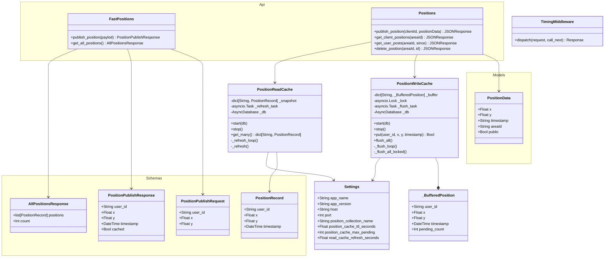
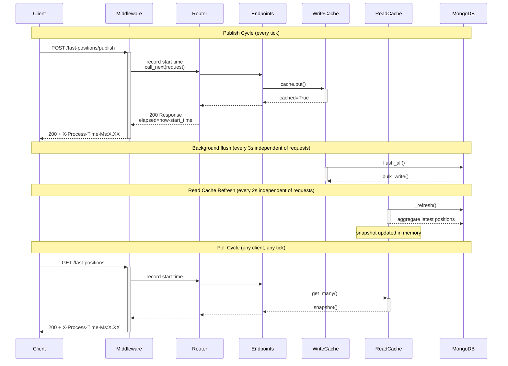

# microsync

## Project Structure

```
microgeo/
├── app/
│   ├── main.py       # app factory, lifespan, exception handlers
│   ├── api/          # endpoints
│   ├── database/     # database connection(s)
│   ├── middleware/   # database middleware
│   ├── schemas/      # database schemas
│   ├── services/     # Ochestration
│   ├── models/       # data models
│   └── core/         # Settings via env / .env file, app logics
├── tests/
├── pyproject.toml
└── .env
```

## Public API

### Location

The Location API provides CR~~U~~D operations for user position data. 

| User Story                                                      | Method | Path                      | Purpose                                                   |
|-----------------------------------------------------------------|--------|---------------------------|-----------------------------------------------------------|
| 1. Publish Client Position Updates                              | POST   | `/positions/<clientId>`     | Publish a client's current position                       |
| 2. Receive Client Position Updates<br>3. Sync User Data on Maps | GET    | `/positions/<areaId>`       | Get all current positions for an area                     |        
| 2. Receive Client Position Updates<br>3. Sync User Data on Maps | GET    | `/positions/<areaId>/posts` | Get user posts for an area with optional timestamp filter |
|                                                                 | DELETE | `/positions/<areaId>/<id>`  | Delete a specific position entry                          |

### Fast Positions

Fast Positions is an API that allows clients to publish position updates in near real-time. This api uses a [write- and read-cache](#write-cache) to coalesce position updates per user and provide a single point of truth for clients. The caches introduce a small latency between client and server.

| User Story                         | Method | Path                    | Purpose                                     |
|------------------------------------|--------|-------------------------|---------------------------------------------|
| 1. Publish Client Position Updates | POST   | `/fast-positions/publish` | Client publishes current batch of positions |
| 2. Receive Client Position Updates | GET    | `/fast-positions`         | Client polls cached positions               |


## UML Diagram


## Sequencing Diagram: Fast Positions


## MongoDB

### Write Cache

Implements a two-sided position caching layer in front of MongoDB so per-tick position updates from clients don't translate into per-tick DB writes, and so client poll requests resolve from an in-memory snapshot instead of querying Mongo directly.

- PositionWriteCache: coalesces position updates per user into an in-memory buffer, then bulk-flushes to MongoDB on a TTL tick or when any single user accumulates position_cache_max_pending updates.
- PositionReadCache: maintains a user_id -> PositionRecord snapshot rebuilt periodically from MongoDB via a single `$sort + $group` aggregation pipeline. get_many() returns a shallow copy so client reads are a single dict lookup.

The free tier allows up to 100 operations per second. That's shared across all reads and writes hitting the cluster. With 5 clients polling at `20 fps tick rate = 100 writes/sec`, we're sitting right at the ceiling before a single read happens. With the 3-second write cache, that drops to roughly `5 clients ÷ 3 seconds = ~2 writes/sec`, plus poll calls. At 5 clients polling a few times a second, we're looking at maybe 15–20 ops/sec total, well within budget.


### Development Environment
Create and populate `.env.mongodb` environment file in the local project root. The environment file requires the following variables to be defined:


```
MONGODB_URI=<Replace with MongoDB Connection String>
MONGODB_DB_NAME=<Replace with Database Name>
```

> [!CAUTION]
> Do not commit `.env.mongodb` to git

## Git Workflow

#### Sync main before branching
1. `git checkout main`
2. `git pull --rebase origin main`

#### Create branch
1. `git checkout -b feature/task`

#### Write Code/Commit locally
1. `git add .`
2. `git commit -m "message"`

#### To squash a small commit into a bigger one
1. `git rebase -i HEAD~n`

#### Update branch before pushing
1. `git fetch origin` (or git pull)
2. `git rebase origin/main`

#### Push for PR
1. `git push -u origin feature/task`

